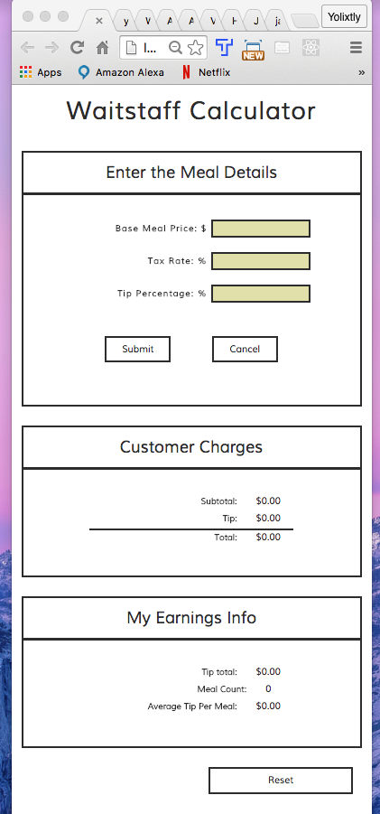

# waitstaff-calculator
Angular Project with Thinkful :http://yolixtly.github.io/waitstaff-calculator/

----- 1st Version Report -----

-The current Version of Waitstaff Calculator works fine! I focus on creating a responsive app using bootrtrap. 

-Currently there is a refactoring I want to apply by using $watchGroup from Angular. The bug presented at the moment, and the only reason I am not using this method is because the error is $watchGroup is not a function. I have double check, that my Angular version supports this method. 

----- 1st Refactor Report ------

-following instructions from my Angular course, we are required to start using ngRoute and split our HTML into templates. Because at this point I just started learning services like factories, I implemented 1 single constructor and made use of $rootScope so that my code can be available in all the views. I continue researching more about it, since it took me a while to understand how to structure my code, more than not understanding $scope vs $rootScope, It was about Objects and inheritance in Javascript. 

-animations where added as well, I feel happy that implementing them was easy and it made so much more sense than the first time I tried them with Angular. 

Views of the project: 

<h3>Desktop View:</h3> 

<h3>Mobile View: </h3>
