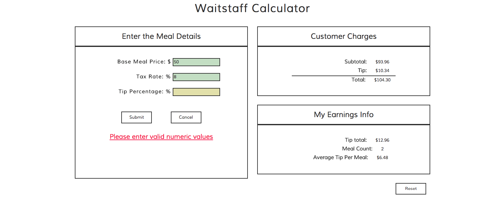

# waitstaff-calculator
Angular Project with Thinkful :http://yolixtly.github.io/waitstaff-calculator/

-The current Version of Waitstaff Calculator works fine! I focus on creating a responsive app using bootrtrap. 

-Currently there is a refactoring I want to apply by using $watchGroup from Angular. The bug presented at the moment, and the only reason I am not using this method is because the error is $watchGroup is not a function. I have double check, that my Angular version supports this method. 

Views of the project: 

<h3>Desktop View:</h3> 

<h3>Mobile View: </h3>
